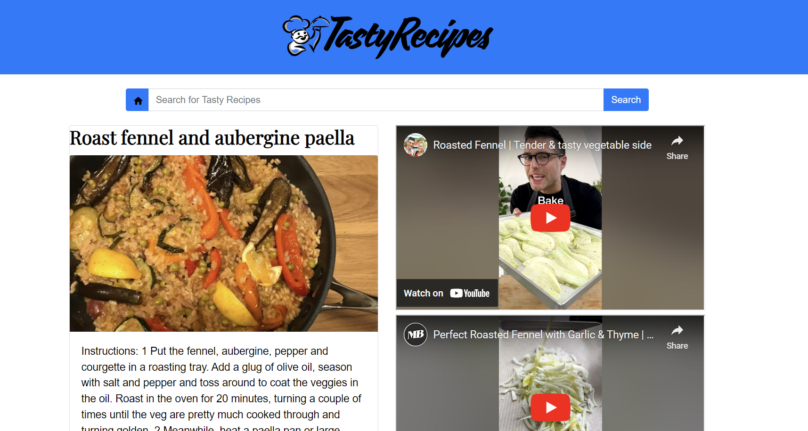
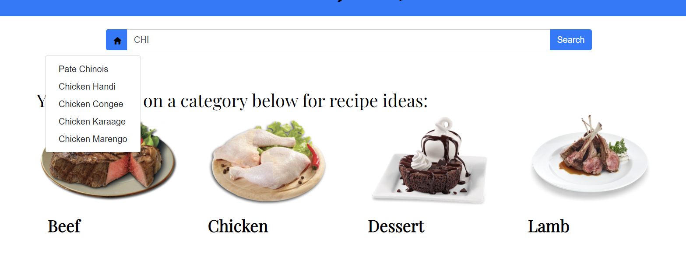
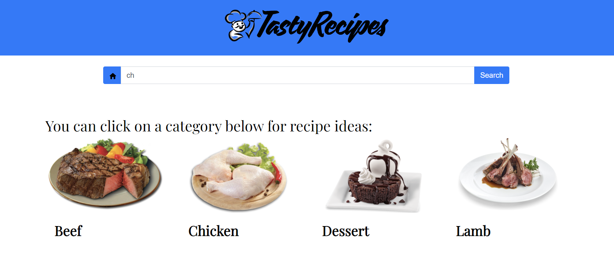
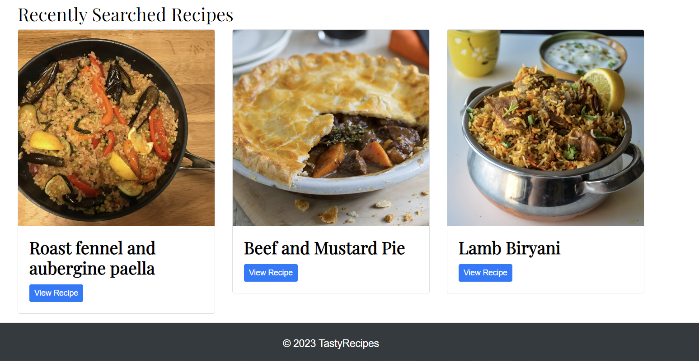
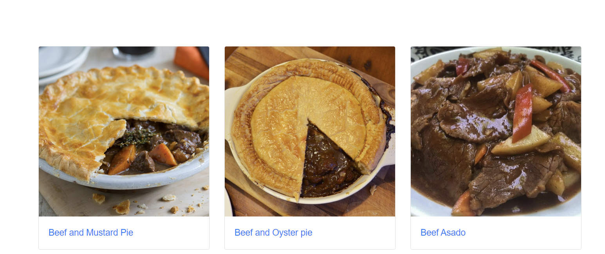
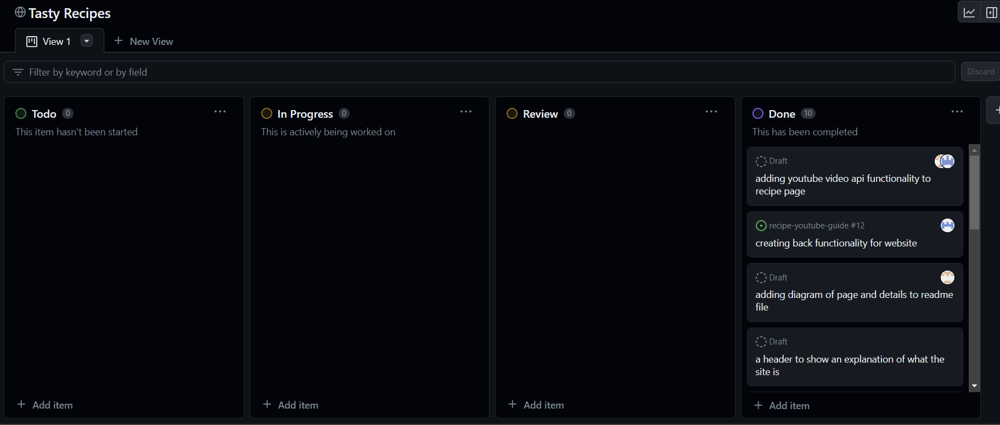

We created a group project where we will be creating a website which allows us to search for recipes. Once we select a recipe via search or from the category we will be given a recipe and video suggestions from Youtube for a tutorials.

## Description

We've created and completed a to-do list on what the MVP is of our project, which includes:

- a header to show an explanantion of what the site is
- a footer created by team members etc
- a search bar to search for recipes
- the recipes show based on whats been searched (recipe api)
- a submit button
- implementation of videos
- we click on a recipe -> a youtube video on a seperate link/tab (youtube api)
- storing what weve searched for
- ensure we use bootstrap
- deployed on a GitHub page
- be interactive and responsive
- have polished UI
- uses modals instead of prompts, confrims and alerts

Impovements once MVP is achieved:

- we click on a recipe and then we are shown a youtube video within the same html
- a favourites section for recipes
- suggestions for searching for recipes based on what is typed... like "chi" ... "chicken pasta, chicken pie etc"

## Technologies Used

We used 2 server-side APIs:

Youtube API: https://developers.google.com/youtube/v3

Recipe/meal API: https://www.themealdb.com/api.php

## Screenshots

Below you can see an example of how a recipe would be displayed

Below you can see there are suggestions for 3 characters being written into the search bar

Below you can see there are no suggestions for 2 characters being written into the search bar

Below you can see there are recently searched recipes added to a container stating recently searched

Below you can see there are options for the beef category

## Using Kanban Board and Agile methodologies

We tried to work in an agile method as a team as much as possible, utilising daily standups and the use of a kanbad board to monitor our tasks. We did a small retro at the end where we came up with future improvments as a team.

Below you can see our kanban board:

## Link to Deployed Website

[Deployed Website](https://balalsaleh.github.io/recipe-youtube-guide/index.html)

[GitHub Repo](https://github.com/balalsaleh/recipe-youtube-guide)
